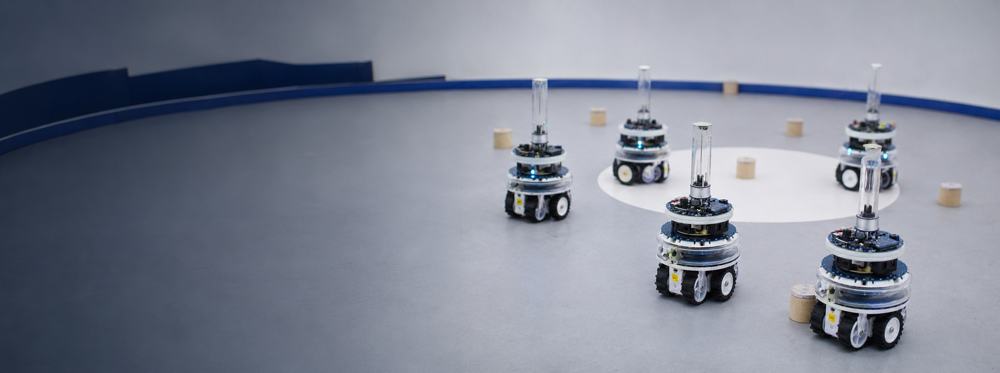
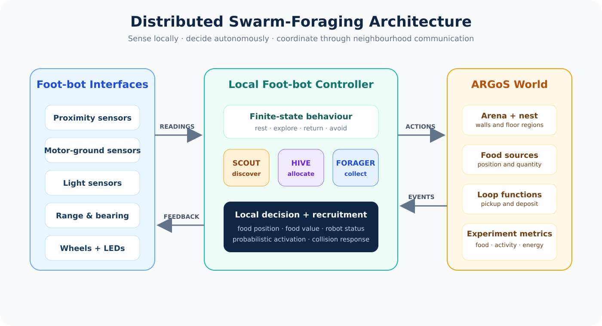
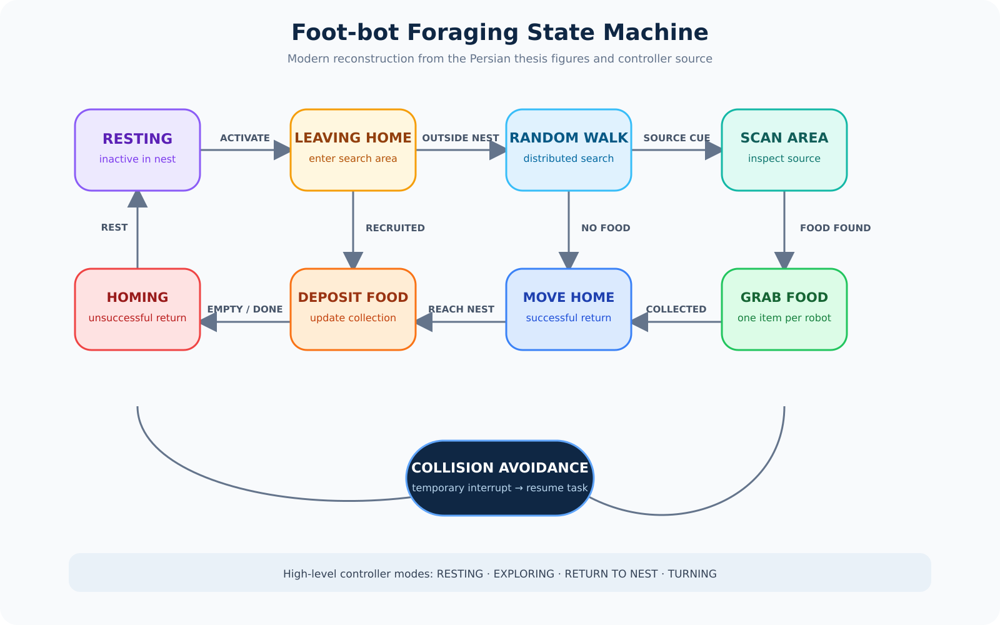
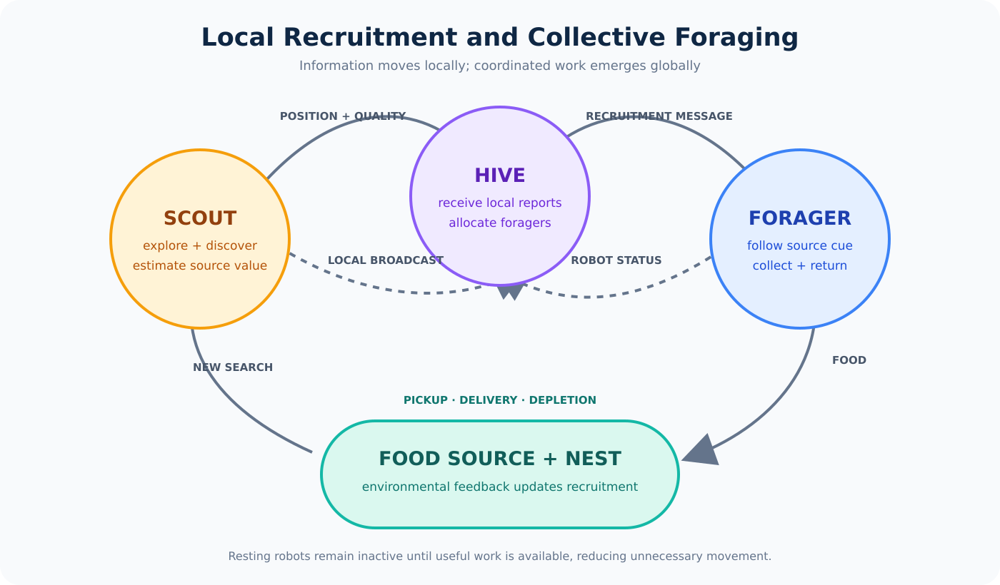
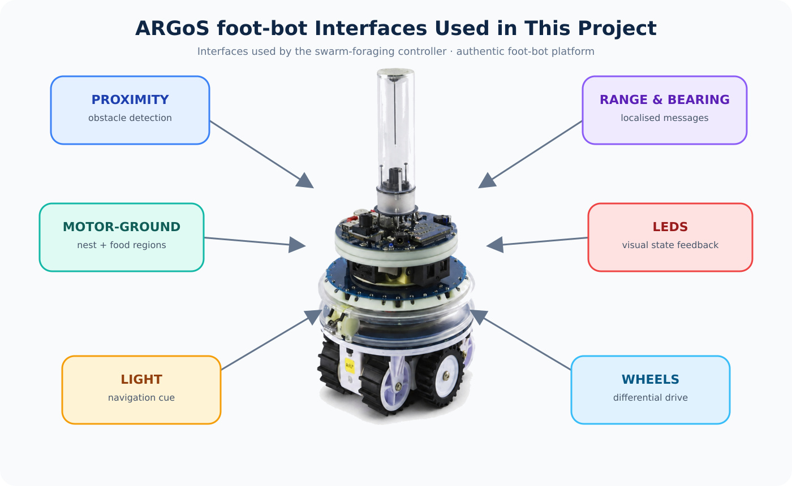

# Swarm Foraging in ARGoS
<p align="center">
  
</p>


<p align="center">
  <strong>Artificial Bee Colony–inspired cooperative foraging, local recruitment, and energy-aware task allocation with simulated foot-bot robots.</strong>
</p>

<p align="center">
  
  
  
  
  
</p>

## Overview

This repository preserves the implementation developed for the master’s research project **“Simulation of Foraging in Swarm Robotics Based on the Artificial Bee Colony Algorithm.”** It models a decentralised swarm of foot-bot robots that searches an unknown arena, recruits nearby robots to promising food sources, transports food to a shared nest, and adapts the number of active robots to reduce unnecessary energy consumption.

The work combines **swarm robotics**, **Artificial Bee Colony principles**, **local range-and-bearing communication**, **finite-state robot control**, and **energy-aware task allocation**. The associated Persian conference paper reports lower energy waste and better efficiency than an adaptive foraging baseline, together with scalability as the arena and swarm sizes increase.

> [!IMPORTANT]
> This is an archival **ARGoS 2** research codebase. Its source includes `argos2/...` headers and uses the ARGoS 2 XML, Qt4, and plug-in interfaces. It is not directly compatible with ARGoS 3 without a deliberate port.

## Research Contribution

The project translates honey-bee colony behaviour into distributed robot roles:

| Biological idea | Robotic interpretation |
|---|---|
| Scout bee | A foot-bot explores unknown regions and detects food |
| Recruitment | A successful scout shares source location and quality locally |
| Forager / employed bee | A recruited foot-bot travels to and exploits a food source |
| Hive / observer | A coordinating role evaluates messages and allocates available foragers |
| Nectar quality | Food quantity or value used to control recruitment intensity |
| Resting bee | An inactive robot avoids unnecessary motion and energy use |

The implementation does not rely on a global map shared by every robot. Coordination emerges from local sensing, local communication, role-specific state machines, and interaction with the arena.

## System at a Glance

<p align="center">
  
</p>

The controller uses the foot-bot’s proximity, light, motor-ground, and range-and-bearing interfaces. ARGoS loop functions create and manage food sources, detect pickup and delivery, track robot activity, and write experiment metrics including collected food and energy-related measures.

## Robot Behaviour

<p align="center">
  
</p>

The source contains two layers of behaviour state:

- **High-level mode:** resting, exploring, returning to the nest, and turning.
- **Operational mode:** leaving home, random walk, scanning, moving to food, collecting food, returning home, depositing food, homing after an unsuccessful search, and collision avoidance.

This diagram is a modern, English reconstruction of the original Persian thesis figures, cross-checked against the `SStateData::EState` and `SStateData::EnState` enumerations and the controller transitions.

## Local Recruitment and Collective Foraging

<p align="center">
  
</p>

Range-and-bearing messages encode food information and robot availability. The source distinguishes scout, hive, and forager roles through controller configuration and message values. Successful discoveries can therefore activate an appropriate subset of resting robots rather than keeping the entire swarm moving continuously.

## The ARGoS foot-bot

<p align="center">
  
</p>

The foot-bot is a modular differential-drive robot developed in the Swarmanoid project. In this simulation, the controller uses:

- wheel actuation for navigation;
- proximity sensing for obstacle avoidance;
- motor-ground sensing to distinguish nest, food, and arena regions;
- light sensing for navigation cues;
- LEDs for visual state feedback; and
- range-and-bearing sensing/actuation for localised robot-to-robot communication.

The schematic documents interfaces used by this repository; it is not a mechanical drawing of the physical robot.

## Repository Structure

```text
.
├── Color-Phase/                   # Colour/quantity-based controller variant
│   ├── footbot_foraging/          # Foot-bot controller plug-in
│   ├── foraging_loop_functions/   # Arena, food, metrics, and visualisation
│   └── foraging_HB_8_2.xml        # Example honey-bee experiment
├── NN-Phase/                      # Neural quantity-estimation variant
│   ├── footbot_foraging/
│   └── foraging_loop_functions/
├── xml/
│   ├── 3/xml/                     # Experiment family 3
│   ├── 4/xml/                     # Experiment family 4
│   └── foraging_HB.xml
├── assets/diagrams/               # Modern vector documentation
├── archive/thesis-figures/        # Original Persian figures/screenshots
├── docs/                          # Research, experiment, and migration notes
├── CITATION.cff
└── README.md
```

Editor backup files ending in `~` were removed from the professional package; the substantive C++, header, CMake, and XML files are preserved.

## Controller Variants

| Variant | Main distinction | Evidence in source |
|---|---|---|
| `Color-Phase` | Food quantity/quality categories drive recruitment decisions | `food_color`, food-source messages, employer allocation |
| `NN-Phase` | Adds neural estimation of food quantity/value | input/hidden/output arrays, `EstimateQuantity()`, backpropagation |

## Experiment Configurations

The repository includes several ARGoS XML families:

- `foraging_HB_*`: honey-bee-inspired role allocation;
- `foraging_adaptive_*`: adaptive-foraging comparison configurations;
- `foraging_HB3.xml` and `foraging_HB_8_2.xml`: additional variants;
- `diffusion_*`, `flocking.xml`, `synchronization.xml`, and `evolution*.xml`: supporting or inherited ARGoS experiments.

Suffixes such as `_4`, `_8`, and `_16` identify experiment variants associated with different forager/swarm settings. Exact entity counts should be read from each XML rather than inferred solely from the filename because scout, hive, and forager quantities are configured separately.

See [Experiment Guide](docs/EXPERIMENTS.md) for a parameter map.

## Metrics Produced by the Simulation

The loop functions write a tab-separated output with:

```text
clock  walking  resting  collected_food  energy  consume_energy  energy_per_food
```

These fields support comparisons of collection performance, active versus resting allocation, cumulative energy behaviour, and energy spent per collected food item. The repository does not contain the original raw result files, so this restoration does **not** fabricate numerical result charts.

## Building and Reproducing

The archived code targets ARGoS 2 and Qt4-era interfaces. A historically compatible environment is required to compile it as written. The included subdirectory `CMakeLists.txt` files build controller and loop-function modules, but the original top-level build file and full environment specification were not preserved.

For that reason, this repository currently serves as:

1. a documented research-software archive;
2. a source reference for the bee-inspired algorithm; and
3. a starting point for a controlled ARGoS 3 port.

Do not run the earlier generic `argos3 -c ...` instruction against these XML files—the controller API and configuration schema differ. See [Legacy Build and Migration Notes](docs/LEGACY_BUILD.md).

## Research Record

### Master’s thesis

**Persian title:** شبیه‌سازی جستجوی غذا در رباتیک ازدحامی بر اساس الگوریتم کلونی زنبورهای مصنوعی  
**English title:** *Simulation of Foraging in Swarm Robotics Based on the Artificial Bee Colony Algorithm*  
**Author:** Hoda Yamani  
**University:** University of Kashan, Faculty of Electrical and Computer Engineering  
**Year:** 1391 / 2012–2013  
**Supervisor:** Hossein Ebrahimpour-Komleh  
**Advisors indexed by Elmnet:** Ahmad Yoosofan and Morteza Babamir  

[Persian thesis catalogue record](https://lib.kashanu.ac.ir/Inventory/7/4791.htm) · [Elmnet author and thesis record](https://elmnet.ir/author/%D9%87%D8%AF%DB%8C-%DB%8C%D9%85%D8%A7%D9%86%DB%8C)

### Conference paper

**Persian title:** شبیه‌سازی الگوریتم تطبیقی جستجوی غذای کلونی زنبورهای عسل در رباتیک ازدحامی به منظور بهینه‌سازی مصرف انرژی  
**Authors:** Hoda Yamani and Hossein Ebrahimpour-Komleh  
**Venue:** 11th National Conference on Intelligent Systems  
**Year:** 1391  
**Document ID:** ICS11_122

[Civilica record and abstract](https://civilica.com/doc/214704/)

## Citation

If you use the repository, please cite the associated conference work:

```bibtex
@inproceedings{yamani1391adaptive_swarm_foraging,
  author    = {Hoda Yamani and Hossein Ebrahimpour-Komleh},
  title     = {Simulation of an Adaptive Honey-Bee Colony Foraging Algorithm
               in Swarm Robotics for Energy-Consumption Optimisation},
  booktitle = {11th National Conference on Intelligent Systems},
  year      = {1391},
  language  = {Persian},
  note      = {Civilica document ICS11_122},
  url       = {https://civilica.com/doc/214704/}
}
```

Repository citation metadata is also available in [`CITATION.cff`](CITATION.cff).

## References

- [ARGoS official website](https://www.argos-sim.info/)
- [ARGoS simulator paper](https://doi.org/10.1007/s11721-012-0072-5)
- [Official ARGoS foot-bot entity documentation](https://www.argos-sim.info/api/a01420.php)
- [Associated Persian conference paper](https://civilica.com/doc/214704/)
- [Master’s thesis catalogue record](https://lib.kashanu.ac.ir/Inventory/7/4791.htm)

## Author

**Hoda Yamani**  
Machine Learning · Reinforcement Learning · Robotics · Intelligent Systems

[GitHub](https://github.com/h-yamani) · [ORCID](https://orcid.org/0009-0007-0484-6862)

---

<p align="center"><em>From local sensing and recruitment to energy-aware collective intelligence.</em></p>

