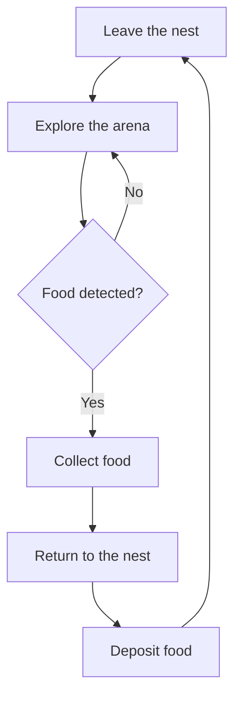
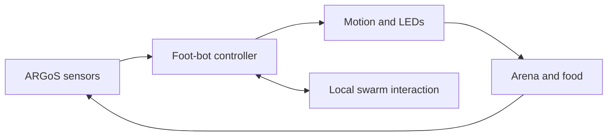

# Swarm Foraging in ARGoS

<p align="center">
  <b>Artificial Bee Colony–inspired cooperative foraging with foot-bot robots</b>
</p>

<p align="center">
  <a href="https://www.argos-sim.info/"></a>
  
  
  
  
</p>

## Overview

This repository contains an **ARGoS simulation of cooperative foraging in a swarm robotic system**, inspired by the **Artificial Bee Colony (ABC) algorithm**. A group of autonomous foot-bot robots searches the arena for food, collects discovered items, and transports them to a shared nest.

The project demonstrates how simple local behaviours can produce coordinated swarm-level performance without a central controller. It is intended as a research and educational implementation for studying swarm intelligence, distributed decision-making, and bio-inspired robotics.

## Foraging scenario

Each robot repeatedly moves through a local sense–decide–act cycle:



The overall swarm behaviour follows the core ideas of ABC:

| ABC concept | Swarm-foraging interpretation |
|---|---|
| Food source | A food item or promising region in the arena |
| Employed bee | A robot exploiting a discovered food source |
| Onlooker bee | A robot selecting useful shared information |
| Scout bee | A robot exploring for new food sources |
| Nectar quality | The value or usefulness of a discovered source |
| Hive | The shared nest and food-deposit area |

## System architecture



The implementation combines:

- autonomous foot-bot control;
- exploration and obstacle avoidance;
- food detection, collection, and delivery;
- local robot-to-robot interaction;
- nest navigation; and
- experiment configuration and visualisation in ARGoS.

## Requirements

- Linux (recommended)
- [ARGoS 3](https://www.argos-sim.info/)
- C++ compiler with C++11 support
- CMake
- Make
- Qt/OpenGL support for the ARGoS visualiser

Confirm that ARGoS is available before building:

```bash
argos3 --version
```

## Build

Clone the repository and compile it from the project root:

```bash
git clone https://github.com/h-yamani/Swarm-Foraging-In-Argos.git
cd Swarm-Foraging-In-Argos
mkdir -p build
cd build
cmake ..
make -j"$(nproc)"
cd ..
```

If CMake cannot locate ARGoS, provide the directory containing `ARGoSConfig.cmake`:

```bash
cmake -DCMAKE_PREFIX_PATH=/path/to/argos3 ..
```

## Run a simulation

First, locate the available ARGoS experiment configuration:

```bash
find . -type f -name "*.argos"
```

Then run the required configuration from the repository root:

```bash
argos3 -c path/to/experiment.argos
```

Running from the repository root is recommended because experiment files may use relative paths to controller libraries and other resources.

## What to observe

During a simulation, observe how:

1. robots leave the nest and distribute themselves through the arena;
2. individual robots search without global knowledge of the environment;
3. robots respond to food discoveries using ABC-inspired roles;
4. collected food is returned to the common nest; and
5. repeated local decisions create an organised swarm-level foraging pattern.

Useful experimental measures include the number of collected items, collection rate, search time, travelled distance, collision frequency, and performance as swarm size changes.

## Research background

This repository originated from the following research project:

> **Simulation of Foraging in a Swarm Robotic System Based on the Artificial Bee Colony Algorithm**  
> Hoda Yamani, 2013  
> Supervisor: Dr Hossein Ebrahimpour-Komleh  
> Advisor: Ahmad Yoosofan

The work investigates how the division of labour and search behaviour observed in honey-bee colonies can be adapted to decentralised robotic foraging.

## Limitations

This is a legacy academic research prototype. Modern ARGoS, compiler, or operating-system versions may require small compatibility changes. Exact behaviour and performance also depend on the selected experiment configuration and its parameters.

## Citation

If this repository supports your research, please cite the project as:

```bibtex
@misc{yamani2013swarmforaging,
  author       = {Hoda Yamani},
  title        = {Simulation of Foraging in a Swarm Robotic System Based on the Artificial Bee Colony Algorithm},
  year         = {2013},
  howpublished = {Software repository},
  url          = {https://github.com/h-yamani/Swarm-Foraging-In-Argos}
}
```

## Author

**Hoda Yamani**  
Machine Learning, Reinforcement Learning, and Robotics Researcher

- [GitHub](https://github.com/h-yamani)
- [ORCID](https://orcid.org/0009-0007-0484-6862)

## Acknowledgements

This project uses the [ARGoS multi-robot simulator](https://www.argos-sim.info/) and the foot-bot robotic platform. The behavioural design is inspired by the Artificial Bee Colony optimisation algorithm and collective foraging in social insects.

---

<p align="center">
  Bio-inspired intelligence through local interaction and collective behaviour.
</p>
